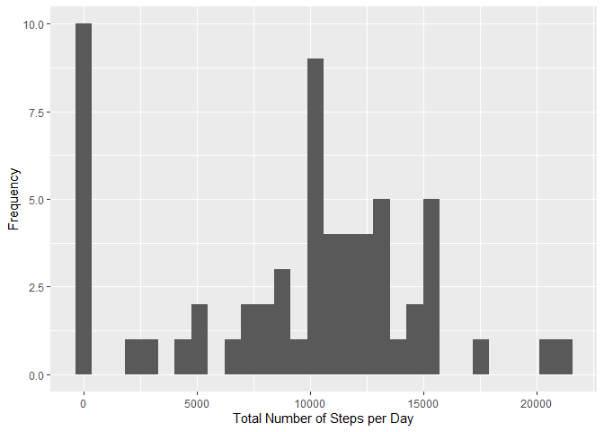
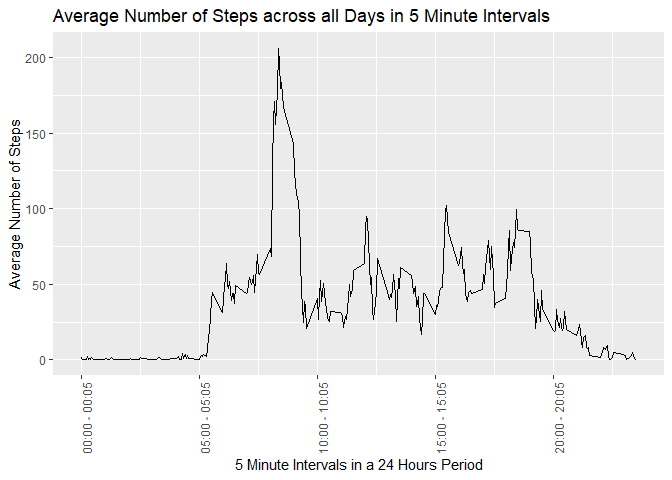
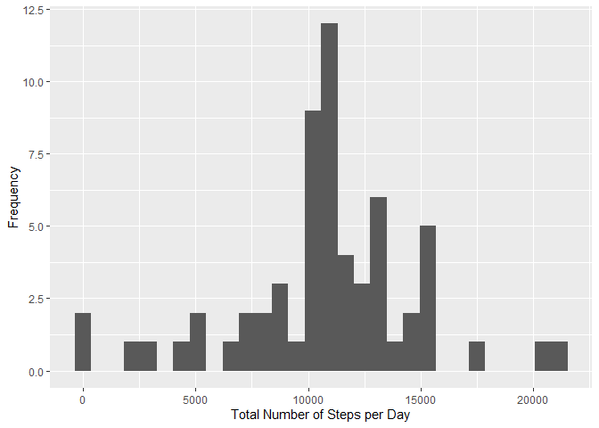
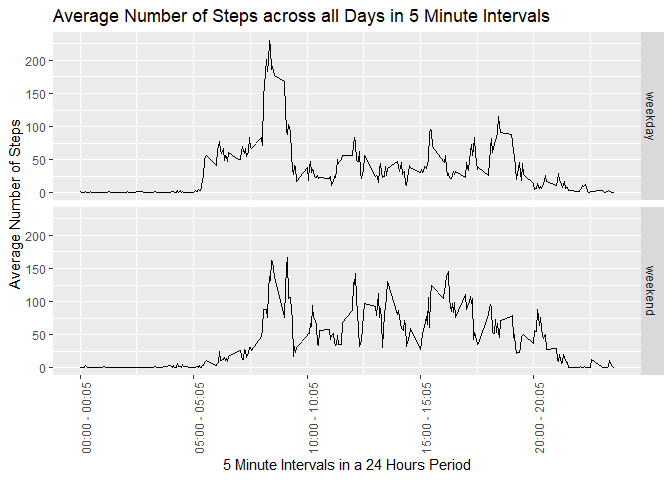

  
This report is submitted, as per requirements, for assignment 1 of the *Reproducible Research* course offered by JHU on Coursera. This report is created using R markdown and processed by knitr. It reports some data analysis done on *personal activity monitoring device* data (more information about data below) to answer certain questions. Those questions are:  

* What is mean total number of steps taken per day? (1. when ignoring the missing    
  values, and 2. when imputing those missing values)  
  - Do the mean and median differ between option 1 and 2?  
  - What is the impact of imputing missing data on the estimates of the total daily   
    number of steps?  

* What is the average daily activity pattern?  
  - Which 5-minute interval, on average across all the days in the dataset, contains 
    the maximum number of steps?  

* Are there differences in activity patterns between weekdays and weekends?  

Information about data, from course assignment page:  

  "It is now possible to collect a large amount of data about personal movement using  
   activity monitoring devices such as a Fitbit, Nike Fuelband, or Jawbone Up. These 
   type of devices are part of the “quantified self” movement – a group of enthusiasts 
   who take measurements about themselves regularly to improve their health, to find  
   patterns in their behavior, or because they are tech geeks. But these data remain 
   under-utilized both because the raw data are hard to obtain and there is a lack 
   of statistical methods and software for processing and interpreting the data.  

   This assignment makes use of data from a personal activity monitoring device. This     device collects data at 5 minute intervals through out the day. The data consists of    two months of data from an anonymous individual collected during the months of  
   October and November, 2012 and include the number of steps taken in 5 minute  
   intervals each day.  

   The data for this assignment can be downloaded from the course web site:  
   [Dataset: Activity monitoringdata](https://d396qusza40orc.cloudfront.net/repdata%2Fdata%2Factivity.zip)   

   The variables included in this dataset are:  

    steps: Number of steps taking in a 5-minute interval (missing values are coded as      NA\color{red}{\verb|NA|}NA)  
    date: The date on which the measurement was taken in YYYY-MM-DD format  
    interval: Identifier for the 5-minute interval in which measurement was taken  

   The dataset is stored in a comma-separated-value (CSV) file and there are a total of    17,568 observations in this dataset."    
    

## Loading and preprocessing the data

### Downloading the data

Project was forked on Github from the following [ GitHub repository created for this assignment](http://github.com/rdpeng/RepData_PeerAssessment1). Then a new project was created in RStudio with version control and linked to the forked repository. The repository was automatically downloaded into the working directory.  

Alternatively, the data can be downloaded from [Dataset: Activity monitoring data](https://d396qusza40orc.cloudfront.net/repdata%2Fdata%2Factivity.zip).  

This piece of code downloads and unzips the "activity.zip" from the link mentioned above in case it is not present in the current working directory. Otherwise, it checks if it is unzipped, and unzips it if it is not. 


```r
if(!file.exists("activity.zip")){
  url <- "https://d396qusza40orc.cloudfront.net/repdata%2Fdata%2Factivity.zip"
  download.file(url, destfile="activity.zip")
  unzip(zipfile = "activity.zip")
} else if (!file.exists("activity.csv")){
  unzip(zipfile="activity.zip")
  }
```

### Loading the data into R  

```r
data<- read.csv("activity.csv")
```

### Processing the data  

```r
data$date <- as.Date(data$date) # Setting the class of the  date variable to be Date
```


## What is mean total number of steps taken per day?  

The total number of steps taken per day is calculated and visualized on a histogram plot. At this stage, the NA values are ignored. Also, the mean and median of the total number of steps taken per day are calculated. These, will be compared to the results when are NA values are imputed.  

### Histogram of the total number of steps taken each day (ignoring NAs)

```r
library(tidyverse)
# ignoring NAs 
p<- data %>% group_by(date) %>% summarise(stepsum=sum(steps, na.rm=T))
p %>% ggplot(aes(stepsum)) + geom_histogram() + xlab("Total Number of Steps per Day") +
  ylab("Frequency")
```

<!-- -->

### Mean and median number of steps taken each day (ignoring NAs)

```r
# mean and median, NAs ignored
mm_na<- p %>% summarise(mean=mean(stepsum), median=median(stepsum))
data.frame(mm_na)
```

```
##      mean median
## 1 9354.23  10395
```


## What is the average daily activity pattern?  

A time series plot of the 5-minute intervals and the average (across all days) number of steps taken was made to see the average daily activity pattern.  

### Time series plot of the average number of steps taken

```r
library(tidyverse)
ts<- data %>% group_by(interval) %>% summarise(average=mean(steps, na.rm = T))
breaks <- c(0,500, 1000, 1500, 2000)
labels <- c("00:00 - 00:05","05:00 - 05:05", "10:00 - 10:05", 
            "15:00 - 15:05", "20:00 - 20:05")
ts %>% ggplot(aes(interval,average)) + geom_line() + 
  scale_x_continuous(breaks= breaks,labels= labels) + 
  theme(axis.text.x=element_text(angle=90)) +
  xlab("5 Minute Intervals in a 24 Hours Period") +
  ylab("Average Number of Steps") +
  ggtitle("Average Number of Steps across all Days in 5 Minute Intervals")
```

<!-- -->


### The 5-minute interval that contains the maximum number of steps is: 

```r
maxint <- ts$interval[which.max(ts$average)]
maxint2<- maxint + 5
library(stringr)
maxint <- str_pad(maxint,4, pad="0")
maxint2 <- str_pad(maxint2,4, pad="0")
maxint<- format(strptime(maxint,format="%H%M"), format= "%H:%M")
maxint2<- format(strptime(maxint2,format="%H%M"), format= "%H:%M")
paste(maxint,maxint2, sep=" - ")
```

[1] "08:35 - 08:40"

## Imputing missing values  

### Only the first column has NAs; steps  

```r
sapply(data, function(x)any(is.na(x)))
```

```
##    steps     date interval 
##     TRUE    FALSE    FALSE
```

### The total number of missing values in the dataset is:

```r
index_na<- which(is.na(data$step))
length(index_na)
```

```
## [1] 2304
```

### The percentage of missing values in the dataset is:

```r
mean(is.na(data$step))*100
```

```
## [1] 13.11475
```

### Imputing NAs of *steps* strategy: Replacing NAs with the mean for that 5-minute interval

```r
imputedata <- data %>% group_by(interval) %>% mutate(avg=mean(steps, na.rm=T))
index_na<- which(is.na(data$step))
imputedata$steps[index_na] <- imputedata$avg[index_na]
imputedata <- imputedata %>% select(steps,date,interval)
```

### Checking that there are no more NAs

```r
sapply(imputedata, function(x)any(is.na(x)))
```

```
##    steps     date interval 
##    FALSE    FALSE    FALSE
```

### Histogram of the total number of steps taken each day (imputed NAs)

```r
library(tidyverse)
# imputed NAs, i.e. no more NAs
n <- imputedata %>% group_by(date) %>% summarise(stepsum=sum(steps))
n %>% ggplot(aes(stepsum)) + geom_histogram() + xlab("Total Number of Steps per Day") +
  ylab("Frequency")
```

<!-- -->

### Mean and median number of steps taken each day (imputed NAs)

```r
# mean and median, NAs imputed
mm_im<- n %>% summarise(mean=mean(stepsum), median=median(stepsum))
data.frame(mm_im)
```

```
##       mean   median
## 1 10766.19 10766.19
```

### Do these values differ from the estimates from the first part of the assignment? What is the impact of imputing missing data on the estimates of the total daily number of steps?  

The mean increased after replacing missing values with the mean value for the corresponding interval. We also notice, that the frequency of the first bin decreased by around 8 days (occurances). These are now distributed around the mean and median and maybe justiffy the increase in those two values.  

## Are there differences in activity patterns between weekdays and weekends?  

A panel time series plot for each of "weekday" and "weekend" of the 5-minute intervals and the average (across all days) number of steps taken was made to see and compare the average daily activity pattern. To do this, a new factor variable in the dataset with two levels “weekday” and “weekend” was created indicating whether a given date is a weekday or weekend day.  

### Time series plot of the average number of steps taken for weekdays and weekends

```r
library(tidyverse)
weekend <- c("Saturday", "Sunday")
imputets<- imputedata %>%
  mutate(day=as.factor(ifelse(weekdays(date) %in% weekend,"weekend","weekday"))) %>% 
  group_by(interval,day) %>% summarise(average=mean(steps))
breaks <- c(0,500, 1000, 1500, 2000)
labels <- c("00:00 - 00:05","05:00 - 05:05", "10:00 - 10:05", 
            "15:00 - 15:05", "20:00 - 20:05")
imputets %>% ggplot(aes(interval,average)) + geom_line() + 
  scale_x_continuous(breaks= breaks,labels= labels) + 
  theme(axis.text.x=element_text(angle=90)) +
  xlab("5 Minute Intervals in a 24 Hours Period") +
  ylab("Average Number of Steps") +
  ggtitle("Average Number of Steps across all Days in 5 Minute Intervals") +
  facet_grid(day ~ .)
```

<!-- -->

### Summary  and differences for weekend and weekday   


```r
summary(imputets$average[imputets$day=="weekday"])
```

```
##    Min. 1st Qu.  Median    Mean 3rd Qu.    Max. 
##   0.000   2.247  25.803  35.611  50.854 230.378
```

```r
summary(imputets$average[imputets$day=="weekend"])
```

```
##    Min. 1st Qu.  Median    Mean 3rd Qu.    Max. 
##   0.000   1.241  32.340  42.366  74.654 166.639
```

We notice that the mean and median are higher in the weekend than in the weekday, and that the maximum value in the weekend is less than that of the weekday. Also, from the graph, we notice that around 5:00 am to around 8:30 am the average in the weekend is less than that of the weekday.
